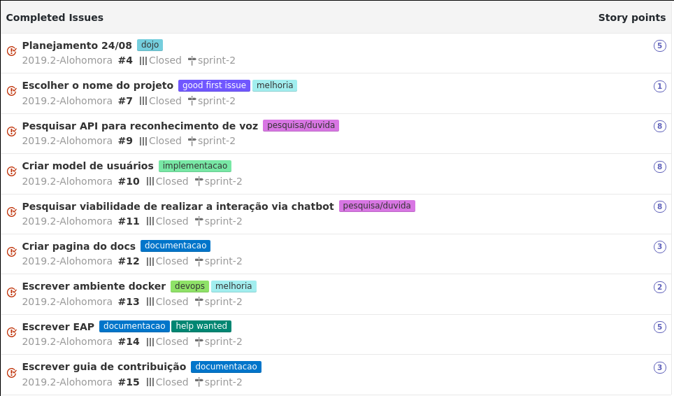
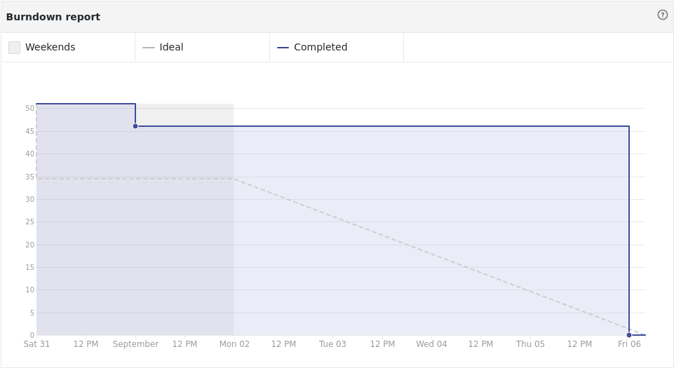

## Contexto da Sprint 2

Esta é a primeira sprint onde temos a ideia do nosso projeto. Iremos dar continuidade nos treinamentos bem como a análise de
viabilidade técnica (principalmente no que se diz respeito ao reconhecimento por voz). Além disso iremos começar a consolidar
o ambiente de desenvolvimento em docker/docker-compose para toda a equipe.

## Tarefas

## Burndown

## Notas do Scrum master.

Nesta sprint foi a primeira vez que tivemos contato com o problema. Ao que tudo indica a parte mais complicada será realmente
a autenticação por voz. Pesquisamos a viabilidade de várias APIs porém ou eram soluções pagas ou não faziam a autentifcação por voz.

A equipe também iniciou a fase de implementação do sistema e com isso surgiu várias problemas no primeiro contato com as
tecnologias, caso esse problema continue iremos realizar um dojo somente para graphql e django.

Em nossa aba de comunidade ainda não colocamos a licença, iremos sincronizar o time quanto a quais opções temos e o que isso
afeta e esperamos uma escolha democrática feita pela maiores parte do time na próxima sprint.

Por fim, todos os membros realizaram um brainstorm para definir o escopo do projeto. Os pontos definidos nele serão escritos no documentos de visão do projeto.
