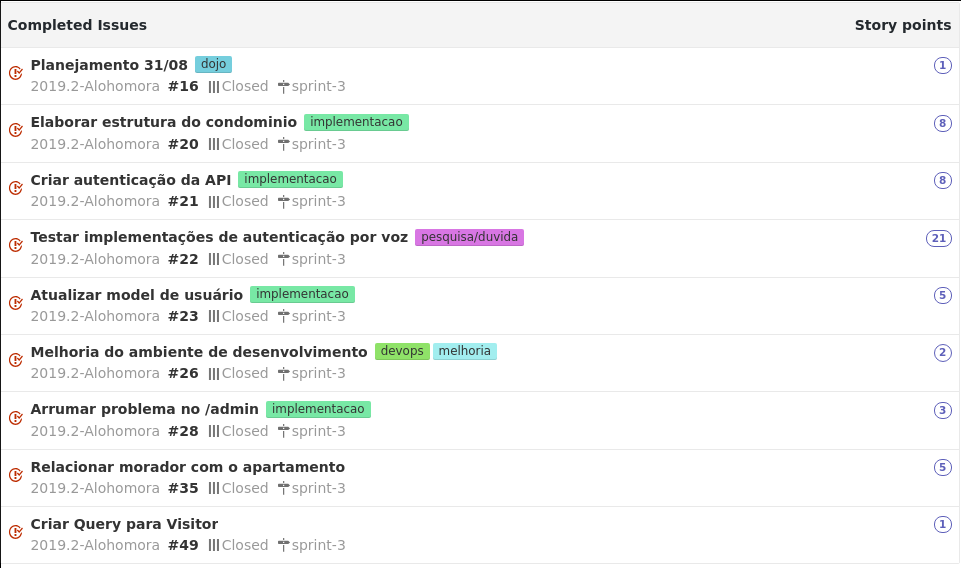
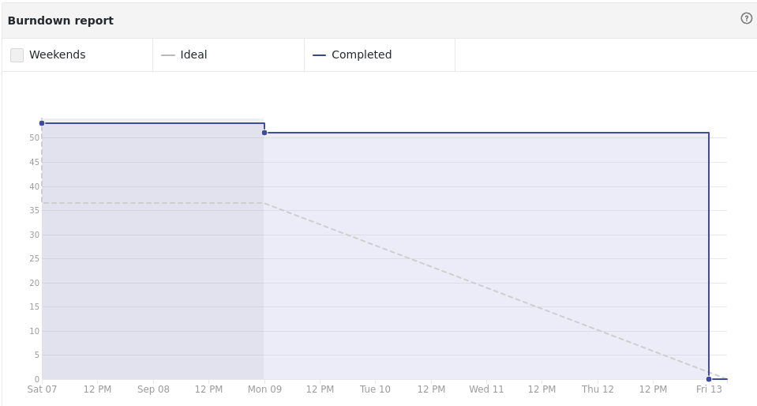

## Contexto

Nesta sprint iniciaremos a implementação da interface de usuário via bot no telegram. Também estamos criando os endpoints para salvar as informações dos usuários via API.

A equipe irá implementar tentar implementar o seu próprio algoritmo de autenticação por voz, na última sprint ficou evidente que não existem serviços de autenticação por voz gratuitos.

## Tarefas

## Burndown

## Review

### Negativos

* eps ainda não consegue participar da reunião
* EPS é negligente pra C@ralho
* definir o PO
* MDS apanhando pra graphql
* Não teve CI implementado ainda
* Devidir melhor as tarefas na issue
* MDS (Luis) esquecendo do co-authored-by
* EPS comentar mais no git

### Melhorias

* liberar os membros de EPS que estão estagiando para fazer via DailyBot
* colocar as issues de EPS já na planning.
* preparar um dojo de graphql para o proximo encontro
* priorizar a integração continua na semana
* avaliar a possibilidade de fazer um template
* Passar mais atividades para as duplas conseguirem trabalhar
* issues não estão sendo atomicas

### Positivos

* MDS apanhando pra graphql
* respostas dos membros de EPS no slack aumentaram
* conseguir implementar um primeiro algoritmo de reconhecimento por voz
* a daily no dailybot está sendo bem respeitada
* o grupo começou a entender o projeto

## Notas do Scrum master.

Nessa semana tivemos algumas evoluções muitos importantes para o progresso do projeto. Primeiramente os membors de MDS conseguiram entender bem melhor sobre o que se trata o projeto em si (discurso do próprio time), provavelmente isso é reflexo do *brainstorm* da última sprint. Outro grande avanço foi o nosso primeiro resultado com o algoritmo DTW para autenticação que se mostrou uma opção viável.

O grupo ainda esta tendo algumas falhas de comunicação e isso esta atrasando um pouco o dominio das tecnologias. O conhecimento fica muito concentrado em poucas pessoas que já fizeram o trabalho. Estamos tentando rotacionar as tarefas o máximo possível para resolver este problema.
