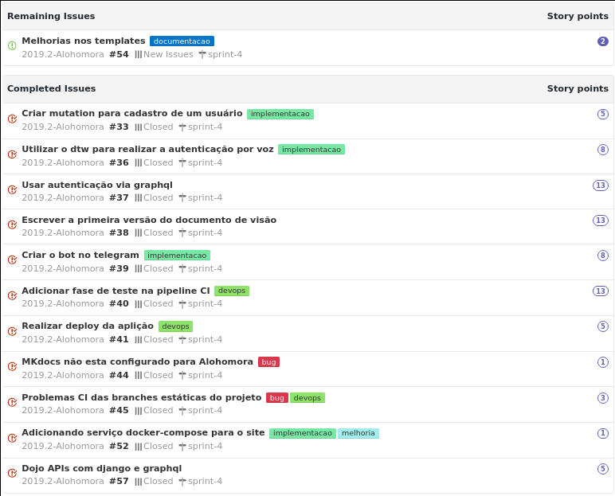
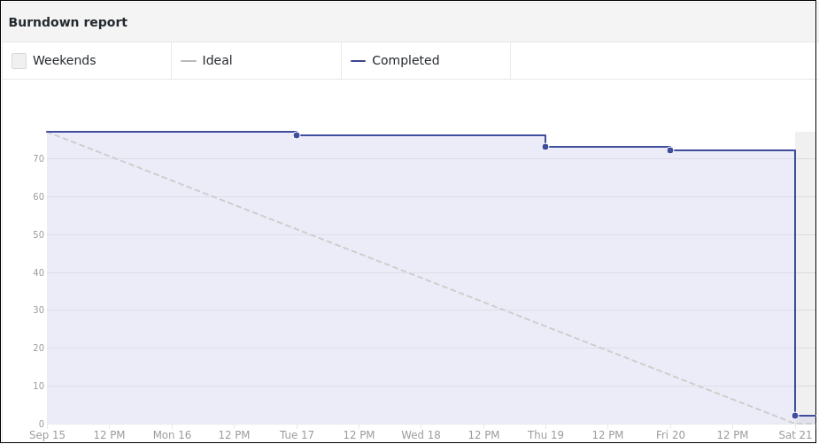

## Contexto

Nessa sprint pretendemos colocar o time de desenvolvimento em um ritmo mais adequado a um ambiente de desenvolvimento profissional (pipelines de CI, testes, conferência de código). Para isso iremos estabelecer várias issues de melhorias principalmente no tocanto a integração contínua.

Além disso começaremos a trabalhar na documentação com o intuito de sincronizarmos o pensamento da equipe sobre a regra de negócio.

## Tarefas

## Burndown

## Review sprint 4

### Negativos

* devops macacando
* Falta de membros da equipe na daily
* Melhoria na comunicação
* Trabalho muito focado em  alguns dias da semana
* tem pouco trabalho
* realizar os PR mais cedos

### Melhoria

* Adicionar mais trabalho pro devops que ta pouco
* Escrever mais nas issues e realizar melhorias no enunciado (Felipe)
* colocar mais issues
* Fazer mais PR

### Positivos

* Conseguimos realizar o trabalho
* Iniciamos os documentos
* apanhamos menos pro graphql
* MDS ta respondendo bem nas issues
* EPS ta conseguindo revisar os PR com uma boa frequencia

## Notas do Scrum master.

Essa semana tivemos muitos erros cometidos por EPS, conferimos a isso o fato das issues do time de EPS não terem sido planejadas com a devida atenção e iremos melhorar na próxima sprint.

Notamos também que terminamos as issues cedo essa semana (contradizendo o burndown, a situação do burndown é reflexo de issues com dependências ou demora na revisão dos PRs). Na próxima semana iremos planejar mais pontos e analizaremos o comportamento da equipe nesse cenário.
