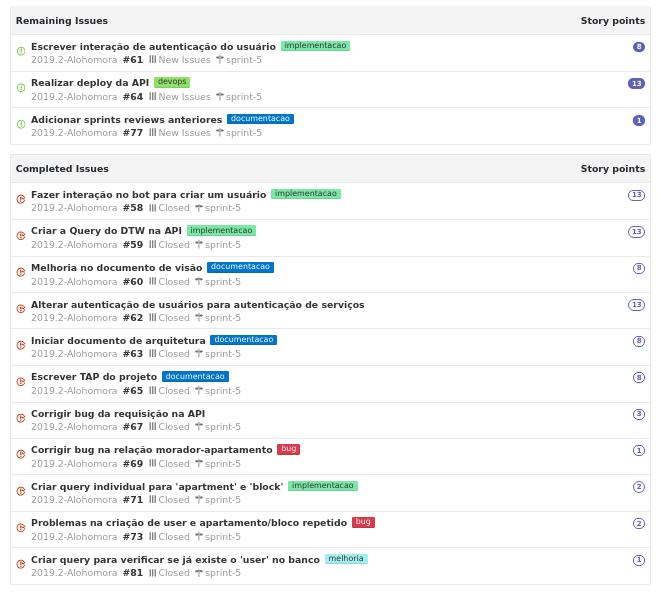
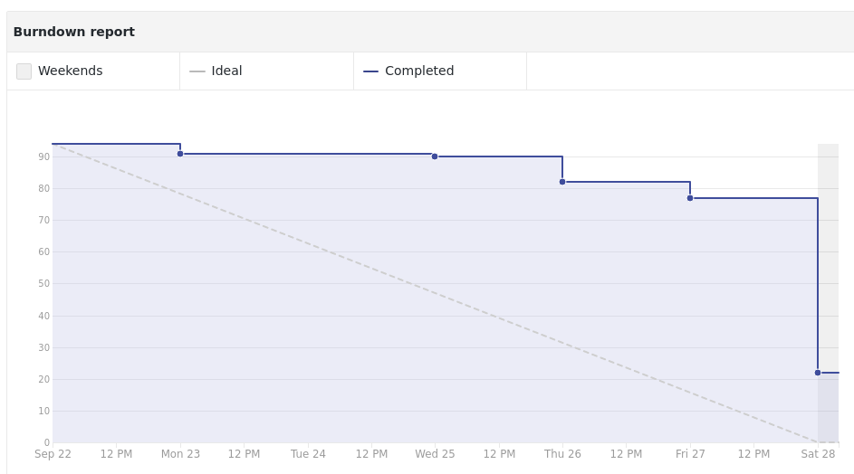

## Contexto

Em resumo essa sprint é a preparação par a primeira release do projeto. Estamos buscando terminar as interações necessárias no telegram para termos as funcionalidades em uma possível demo do projeto.

## Tarefas

## Burndown

## Review

WIP

## Notas do Scrum master.

As documentações foram inicadas porém com grandes ressalvas, estão longe de serem consideradas as versões finais para entrega; porém ja é alguma coisa. Tivemos várias problemas no foco da implementação na integração do DTW com a API.

 É bem complicado conter a euforia do time quanto ao projeto e isso acarreta horas e horas de conjecturas desnecessárias, contudo conseguimos integrar o DTW na API e isso se deve ao comprometimento do time com o projeto.

 As issues que ficaram abertas (dívida tecnica) estão finalizadas porém faltam alguns detalhes como configurar variáveis de ambientes e outros. Assim acredito que não estamos levando peso para próxima sprint.
