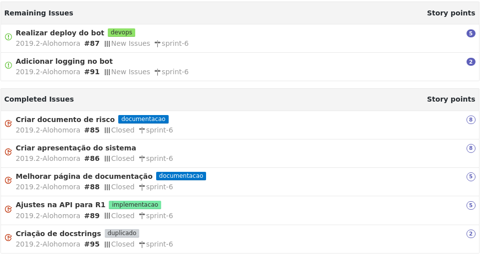
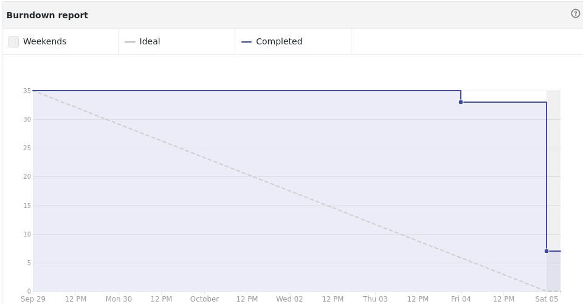

## Contexto

Essa é a sprint que antecede nossa primeira release, teremos poucas tarefas e iremos concentrar nossos esforços em corrigir detalhes e fazer a demo funcionar corretamente.

## Tarefas

## Burndown

## Review

### Pontos positivos

* adiou a primeira release
* A contriução no projeto ta melhorando
* Conseguimos fazer a demo do projeto funcionar
* Carla deu um feedback da nossa apresentação

### Pontos negativos

* adiou a primeira release
* Não ter todo mundo no quadro de contribuição

### Melhorias

* Quem não comitou correr pra comitar algo
* Melhorar a apresentação com o feedback da Carla

## Notas do Scrum master.

Essa sprint foi anormal em pontos e portanto estou retirando ela da avaliação. O fato da R1 ter sido adiada conseguiu trazer mais tempo para terminamos algumas coisas que iriam ser liberadas imaturas.

Relembrando problemas da sprint 3 e 4 o Rodrigo ainda não esta no quadro de contribuidores. Ao que tudo indica isso é uma má configuração do git dele, o time advertiu ele sobre isso e o problema foi resolvido.
